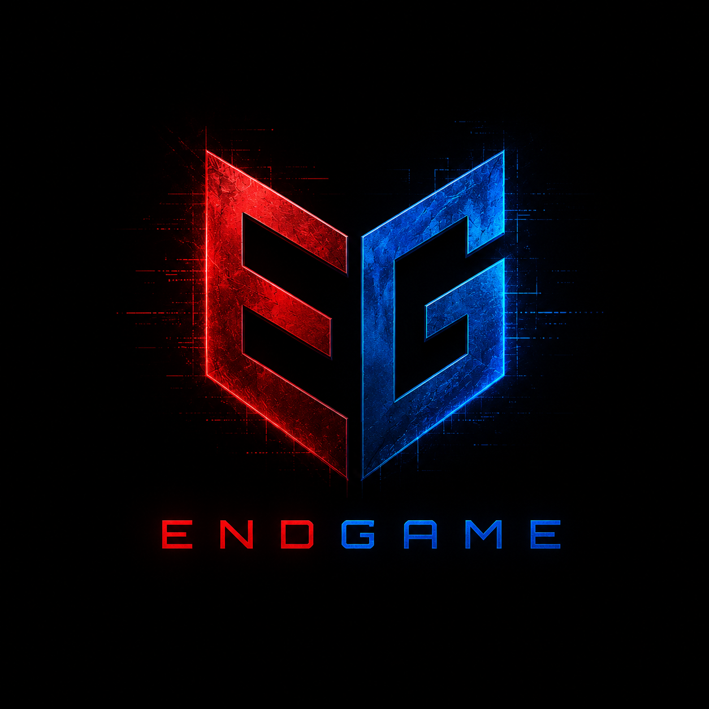
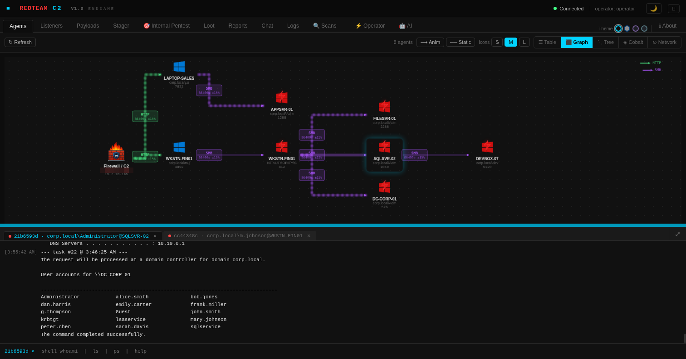
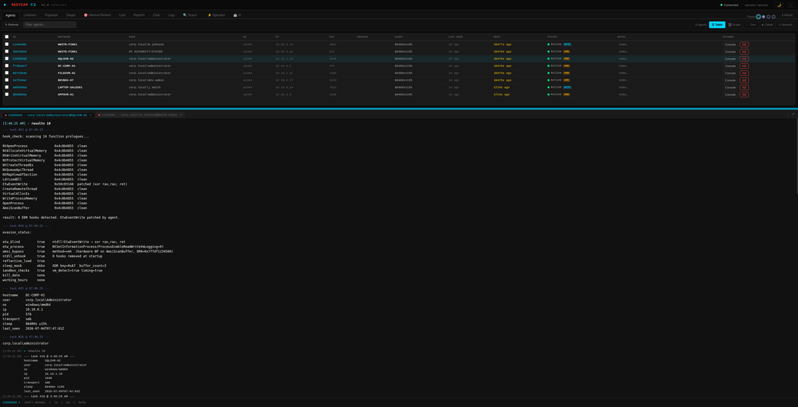
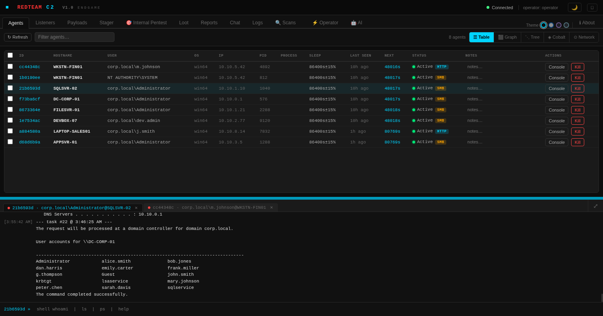

<div align="center">
  
  <h1>ENDGAME C2 FRAMEWORK</h1>
  <br/>

  <p><i>ENDGAME is a professional command and control framework built for authorized red team engagements, penetration testing, and educational security research. Designed to simulate realistic adversary techniques, assess detection coverage, and help security teams understand their defensive gaps — with a built-in <strong>AI Console</strong> that turns natural language into executed commands and automatically analyzes every result.</i></p>

  <p><i>Hecho con IA, pensado y dirigido por un humano.</i></p>

  <p>
    <a href="https://endgamec2framework.com"><b>🌐 endgamec2framework.com</b></a>
    &nbsp;·&nbsp;
    <a href="https://endgamec2framework.github.io/endgame/"><b>📄 Documentation</b></a>
  </p>
  <br/>

  <br /><br />
  <br />

</div>

---

### Quick Start

```bash
git clone https://github.com/endgamec2framework/endgame
cd endgame
./install.sh
```

Re-run `./install.sh` to update — it will pull the latest code and rebuild while preserving certificates and operator profiles.

> Full setup guide: [Documentation → Installation](https://endgamec2framework.github.io/endgame/#install)

---

## 🤖 AI Console — Natural Language Red Teaming

ENDGAME's **AI Console** is a first-class feature that brings an AI co-pilot directly into the operator workflow. It's not a chatbot tacked on the side — it lives in the same panel as your agent terminals, knows the full C2 command set, and has real-time context about the target: hostname, OS, user, privileges, and transport.

### How it works

1. **Right-click any agent** in the Agents table → **Open AI Console**
2. An `🤖` tab opens in the **bottom console pane** — side by side with your regular terminal tabs
3. **Describe your objective** in natural language (in any language)
4. The AI suggests one or more C2 commands, each wrapped in a **▶ Ejecutar** execute card
5. **Confirm execution** — the task is dispatched to the real agent
6. The output comes back and the AI **automatically analyzes the result** and proposes the next step

<div align="center">
  
  &nbsp;
  <br />
  <em>Left: right-click menu · Right: AI Console tab open in the console pane (qwen3.6)</em>
</div>

<br/>

<div align="center">
  <br />
  <em>Command executed on a real mTLS agent · AI analyzes output and suggests SHELL tasklist /v for SYSTEM-privilege process enumeration</em>
</div>

### Key capabilities

| Capability | Detail |
|---|---|
| **Integrated into console pane** | Opens as a tab — no floating modal, no context switch |
| **Full C2 command awareness** | System prompt includes every available command, the agent's OS/arch/privileges, transport, and current task queue |
| **Streaming responses** | Tokens stream in real time as the model generates them |
| **Auto-analysis loop** | After every command execution the output is automatically sent back to the AI for interpretation and next-step recommendation |
| **Multi-session** | Open AI Console for multiple agents simultaneously — each tab maintains independent chat history |
| **Provider agnostic** | Works with **Ollama** (local, offline) or **Anthropic Claude API** — whichever is configured in the AI tab |
| **Confirm before execute** | Every suggested command requires an explicit click — the AI never sends tasks autonomously |

### Supported models (Ollama)

Any model available in your Ollama instance works. Recommended for red team context:

- `qwen3.6:latest` — default · fast · good instruction following
- `qwen3.6:35b-a3b-coding-mxfp8` — larger · stronger code/command reasoning
- `deepseek-r1:8b` / `deepseek-r1:32b` — reasoning models · good at multi-step attack chains
- Any Anthropic Claude model via the Claude API

---

### What's inside

| Component | Summary |
|---|---|
| **Server** | Go binary · multi-operator teamserver · SQLite op-log · mTLS API :31337 |
| **Web GUI** | Kill-chain graph · agent console · **AI Console** · loot manager · AI assistant · multi-operator |
| **Agent (Go)** | Windows/Linux · 7 transports · evasion suite · full post-ex · 7 jump methods |
| **Agent (Nim)** | Windows · lightweight · AMSI/ETW bypass · process injection |
| **Loaders** | C / Go / Nim / shellcode stubs |
| **Reports** | HTML · JSON · CSV · MITRE ATT&CK Navigator layer · AI executive summary |

**Agent transports**: HTTP · HTTPS · mTLS · DNS · DoH · SMB pipe · TCP

**Evasion**: AMSI (VEH/DR0) · ETW blind · NTDLL unhook · Ekko sleep · PPID spoof · header wipe · UDRL phantom DLL · BLOCKDLLS

**Injection**: remote thread · APC early-bird · thread hijack · fork-and-run · hollowing

**Post-ex**: screenshot · keylogger · clipboard · LSASS dump · token theft · UAC bypass · persistence

**Network discovery**: ARP (returns MAC, no elevation on Windows) · ICMP ping sweep · TCP probe — selectable per scan

**Lateral movement**: `psexec` · `smbexec` · `atexec` · `wmi` · `dcom` · `winrm` · `ssh`

**MITRE ATT&CK**: 50+ commands mapped across 12 tactics · Navigator layer export · technique matrix in GUI

> See the [full documentation](https://endgamec2framework.github.io/endgame/) for commands, API reference, IOC list, and operator guide.

---

### Screenshots

<div align="center">
  <br /><br />
</div>

<div align="center">
  <br />
  <em>Graph view + AI Console — query: "Who are the domain administrators?" · response identifies tywin.lannister, robert.baratheon, petyer.baelish, lord.varys in SEVENKINGDOMS.LOCAL</em>
</div>

<div align="center">
  <br />
  <em>🎯 Vector 1: Registry AutoLogon (CRÍTICO) — AI Console docked to the right panel identifies plaintext credentials stored in <code>HKLM\SOFTWARE\Microsoft\Windows NT\CurrentVersion\Winlogon</code> after running SharpUp. No exploit required.</em>
</div>

---

### Legal Notice

> **This tool is for authorized security testing, educational use, and lab environments only.**
> Use against systems without explicit written authorization is illegal and strictly prohibited.
> By using this software you agree to the [Ethical Use Policy](ETHICS.md).

Please do not open issues regarding EDR/AV detection. Default builds include known IOCs — see [IOC documentation](https://endgamec2framework.github.io/endgame/#ioc). Operators should recompile with custom certs, build flags, and malleable profiles for authorized engagements.

