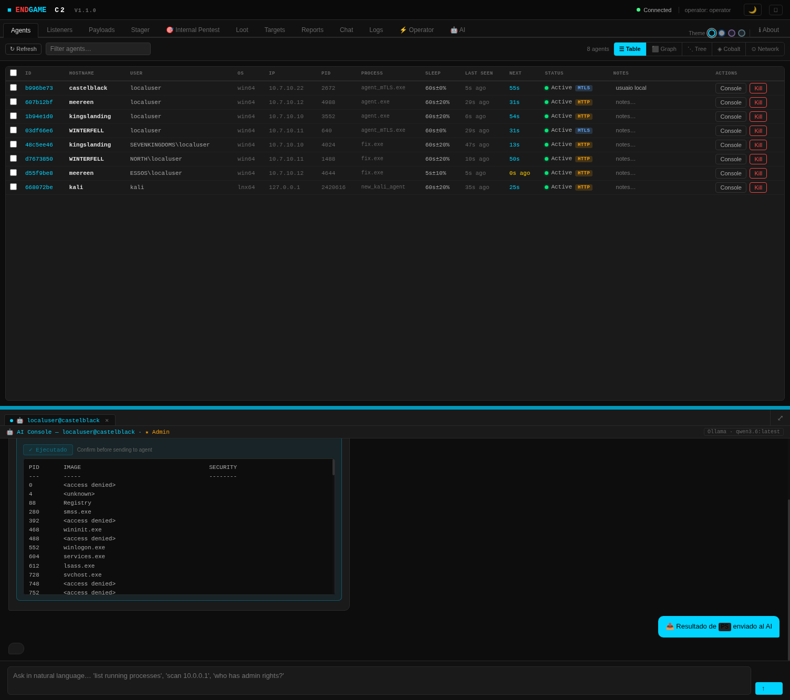

<div align="center">
  
  <h1>ENDGAME C2 FRAMEWORK</h1>
  <br/>

  <p><i>ENDGAME is a professional command and control framework built for authorized red team engagements, penetration testing, and educational security research. Designed to simulate realistic adversary techniques, assess detection coverage, and help security teams understand their defensive gaps — with built-in AI to accelerate campaign analysis and operator decision-making.</i></p>

  <p>
    <a href="https://endgamec2framework.com"><b>🌐 endgamec2framework.com</b></a>
    &nbsp;·&nbsp;
    <a href="https://endgamec2framework.github.io/endgame/"><b>📄 Documentation</b></a>
  </p>
  <br/>

  <br /><br />
  <br />

</div>

---

### Quick Start

```bash
git clone https://github.com/endgamec2framework/endgame
cd endgame
./install.sh
```

Re-run `./install.sh` to update — it will pull the latest code and rebuild while preserving certificates and operator profiles.

> Full setup guide: [Documentation → Installation](https://endgamec2framework.github.io/endgame/#install)

---

### What's inside

| Component | Summary |
|---|---|
| **Server** | Go binary · multi-operator teamserver · SQLite op-log · mTLS API :31337 |
| **Web GUI** | Kill-chain graph · agent console · **AI Console** · loot manager · AI assistant · multi-operator |
| **Agent (Go)** | Windows/Linux · 7 transports · evasion suite · full post-ex · 7 jump methods |
| **Agent (Nim)** | Windows · lightweight · AMSI/ETW bypass · process injection |
| **Loaders** | C / Go / Nim / shellcode stubs |
| **Reports** | HTML · JSON · CSV · MITRE ATT&CK Navigator layer · AI executive summary |

**Agent transports**: HTTP · HTTPS · mTLS · DNS · DoH · SMB pipe · TCP

**Evasion**: AMSI (VEH/DR0) · ETW blind · NTDLL unhook · Ekko sleep · PPID spoof · header wipe · UDRL phantom DLL · BLOCKDLLS

**Injection**: remote thread · APC early-bird · thread hijack · fork-and-run · hollowing

**Post-ex**: screenshot · keylogger · clipboard · LSASS dump · token theft · UAC bypass · persistence

**Network discovery**: ARP (returns MAC, no elevation on Windows) · ICMP ping sweep · TCP probe — selectable per scan

**Lateral movement**: `psexec` · `smbexec` · `atexec` · `wmi` · `dcom` · `winrm` · `ssh`

**MITRE ATT&CK**: 50+ commands mapped across 12 tactics · Navigator layer export · technique matrix in GUI

> See the [full documentation](https://endgamec2framework.github.io/endgame/) for commands, API reference, IOC list, and operator guide.

---

### Screenshots

<div align="center">
  <br /><br />
</div>

#### 🤖 AI Console — integrated natural-language command assistant

Right-click any agent → **Open AI Console** to open an AI-assisted console tab alongside your regular agent terminals. Ask in natural language, get C2 command suggestions, confirm execution, and receive automatic AI analysis of the output.

<div align="center">
  <br />
  <em>AI Console showing PS result analysis with next-step suggestion (qwen3.6)</em>
</div>

---

### Legal Notice

> **This tool is for authorized security testing, educational use, and lab environments only.**
> Use against systems without explicit written authorization is illegal and strictly prohibited.
> By using this software you agree to the [Ethical Use Policy](ETHICS.md).

Please do not open issues regarding EDR/AV detection. Default builds include known IOCs — see [IOC documentation](https://endgamec2framework.github.io/endgame/#ioc). Operators should recompile with custom certs, build flags, and malleable profiles for authorized engagements.
